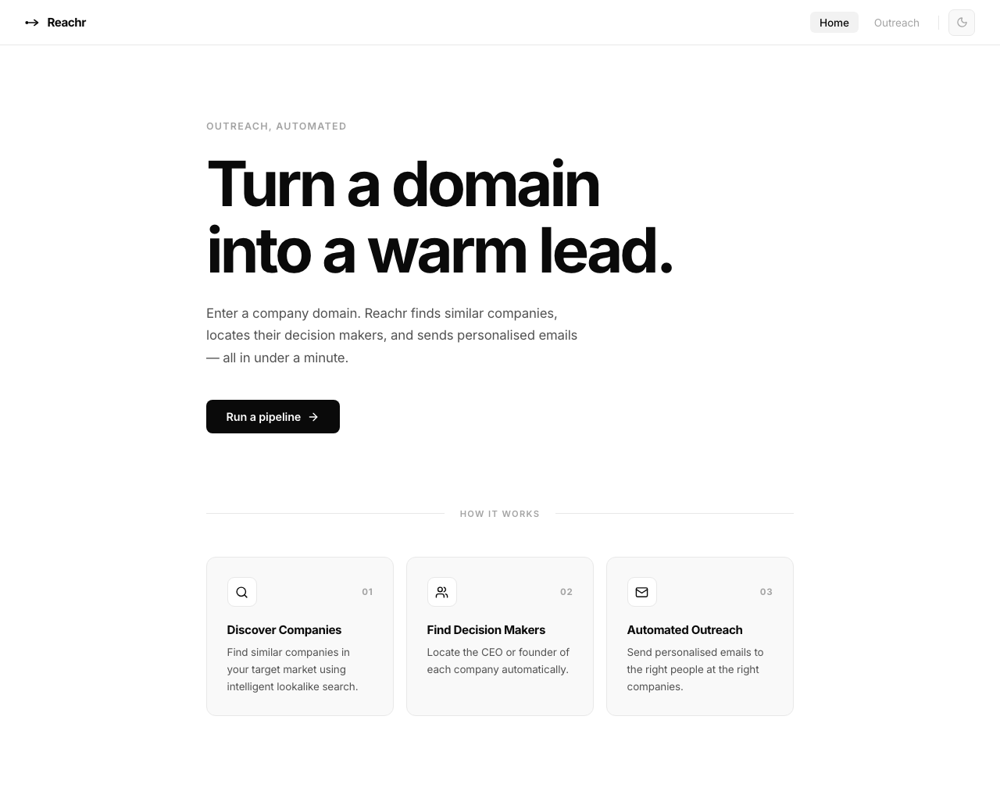
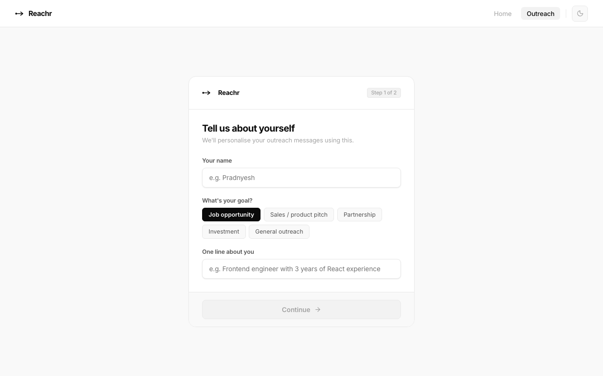

# Reachr

> Turn any company domain into warm outreach — automatically.

Reachr is a full-stack outreach automation tool. Enter a domain, and it finds similar companies, locates their CEO or founder, and generates personalised LinkedIn messages and cold outreach copy tailored to your goal — all in under a minute.

---

## Screenshots

### Homepage


### Outreach Pipeline


---

## How it works

1. **You tell Reachr your goal** — job opportunity, sales pitch, partnership, investment, or general outreach — along with your name and a one-liner about yourself.
2. **Enter a company domain** — e.g. `stripe.com`.
3. **Reachr finds lookalike companies** using the Ocean.io API and locates the CEO or founder at each one via Hunter.io.
4. **Results stream in live** — you see each company and contact as they're discovered.
5. **Generate a personalised message** — one click uses GPT-4o-mini (via GitHub Models) to write a LinkedIn connection note (≤160 chars) and a cold outreach message tailored to the contact's role and company.
6. **Connect directly** — open their LinkedIn profile and paste the message.

---

## Tech stack

| Layer | Technology |
|---|---|
| Frontend | React 19, Vite 5, React Router |
| Backend | Node.js, Express 5 |
| Company discovery | [Ocean.io](https://ocean.io) API |
| Contact lookup | [Hunter.io](https://hunter.io) API |
| Message generation | GPT-4o-mini via [GitHub Models](https://github.com/marketplace/models) |
| Icons | [Lucide React](https://lucide.dev) |

---

## Project structure

```
assignment/
├── backend/
│   ├── controllers/
│   │   └── pipeline.controller.js   # SSE streaming pipeline
│   ├── services/
│   │   ├── ocean.js                 # Lookalike company search
│   │   ├── hunter.js                # CEO/founder lookup
│   │   └── ai.js                   # GPT message generation
│   ├── middleware/
│   │   ├── auth.js
│   │   └── rateLimit.js
│   ├── utils/
│   │   ├── cleanDomain.js
│   │   └── generateEmail.js
│   └── index.js                     # Express server
└── frontend/
    └── src/
        ├── pages/
        │   ├── Home.jsx
        │   └── Outreach.jsx
        ├── components/
        │   └── Navbar.jsx
        ├── ThemeContext.jsx          # Dark / light mode
        └── main.jsx
```

---

## Getting started

### Prerequisites

- Node.js 20.19+ or 22.12+
- API keys for Ocean.io, Hunter.io, and a GitHub personal access token (for GitHub Models)

### 1. Clone the repo

```bash
git clone <repo-url>
cd assignment
```

### 2. Set up the backend

```bash
cd backend
npm install
```

Create a `.env` file in `backend/`:

```env
OCEAN_API_KEY=your_ocean_key
HUNTER_API_KEY=your_hunter_key
GITHUB_AI_KEY=your_github_pat
```

Start the backend:

```bash
npm start
# Server running on port 3000
```

### 3. Set up the frontend

```bash
cd frontend
npm install
npm run dev
# App running on http://localhost:5173
```

---

## API endpoints

| Method | Endpoint | Description |
|---|---|---|
| `POST` | `/pipeline/discover` | SSE stream — finds companies and contacts |
| `POST` | `/generate-message` | Generates LinkedIn note + cold message via GPT |

---

## Features

- **Live pipeline progress** — results stream in via Server-Sent Events, showing each step as it happens
- **Intent-aware messages** — GPT writes different copy depending on whether you're applying for a job, pitching a product, or seeking a partnership
- **Dark / light mode** — respects system preference, persisted to localStorage
- **Company favicons** — each result shows the company's favicon for quick visual scanning
- **Contact avatars** — initials-based avatar generated from the contact's name
- **Copy to clipboard** — one-click copy on both the LinkedIn note and cold message
- **Intro animation** — arrow shoots forward on first load

---

## Limitations

- Currently processes **1 company per run** to stay within free API tier limits
- Hunter.io free plan allows **25 domain searches/month**
- GitHub Models free tier is subject to rate limits on GPT-4o-mini

---

## License

MIT
